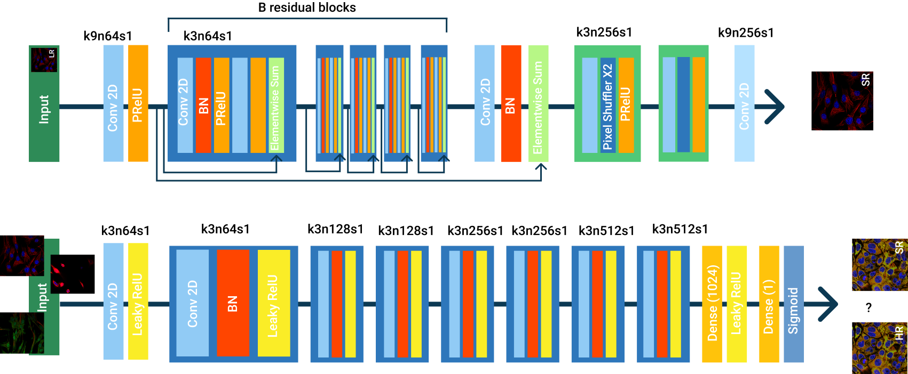
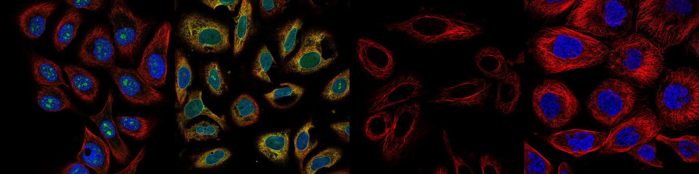
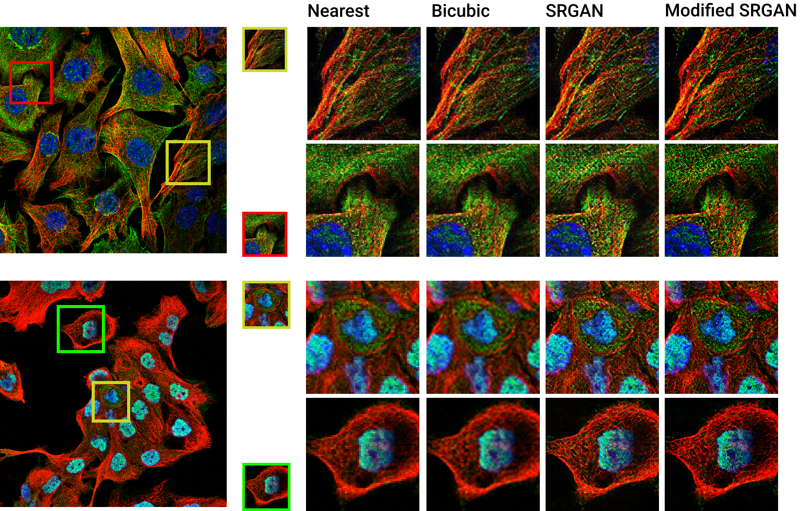
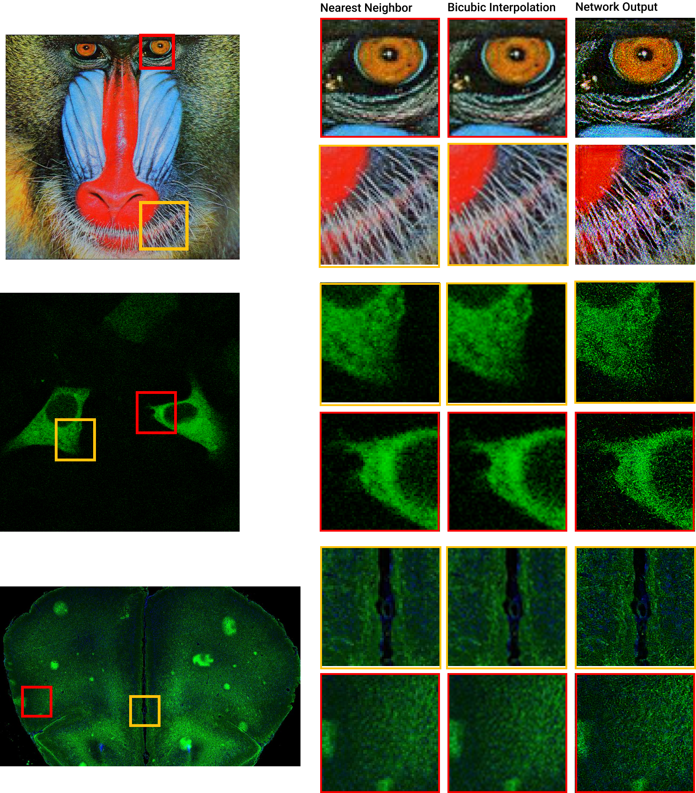
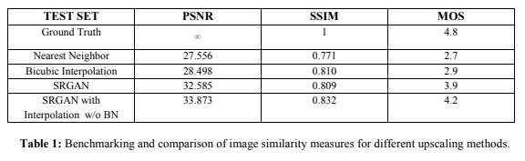
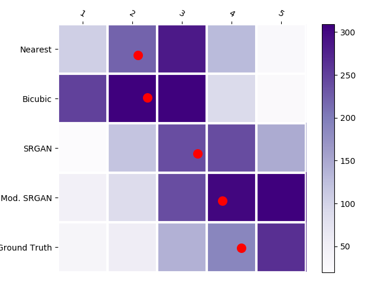

# Real Time Super Resolution For Microscopic Images Using GAN
---

This project is an application of srgan, a network proposed for obtaining super resolved images given low resolution input. In this project, I aimed to improve the existing architecture and optimize it to give comparable if not better results in ream time.

### SRGAN Architecture
---

### Dataset
The Human Protein Atlas Image Classification Challenge is a competition hosted in Kaggle, which
encourages people to develop models which are able to classify proteins in microscopic images. For our
purpose, this dataset provided the most suitable images that we could obtain. These images were obtained
using immunofluorescence confocal microscopy. The training dataset was used which contains a total of 124,
288 images.
The images are given in 4 channels: red, blue, green and yellow, where DAPI staining of the Nucleus: Blue,
Antibody based staining of Microtubules: Red, Endoplasmic reticulum: Yellow, Protein localizations: Green.
The images were generated by a script which produces a random number between 1 and 4 per image, to
generate them in the order 1: microtubules only, 2: microtubules and nucleus staining, 3: microtubules,
nucleus staining and proteins, 4: microtubules, nucleus staining, protein and endoplasmic reticulum. This
ensured a diversity of images obtained for training. A total of 2,000 images of (512 x 512) were obtained.

### Improvements in existing Architecture
---
There were mainly 3 improvements we suggested in the architecture of the existing network : 
1. We proposed the removal of Batch normalization layer
2. We proposed replacing the subpixel layer by first upscaling the image to higher resolution followed by a convolutional layer
3. We proposed replacing the flatten layer with a Global average pooling layer.

The reasoning behind these improvements are given in the paper and can also be found in the links in the references
### Qualitative Results
We give 2 results here, one for our network generating SR images for test images of the dataset and then our network generating SR images for images from other domains

### Quantitative Results

